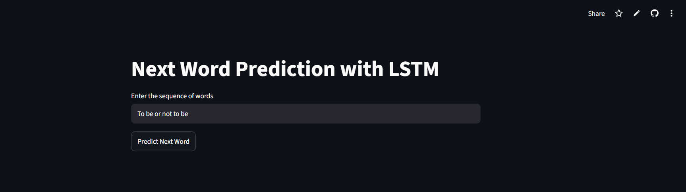
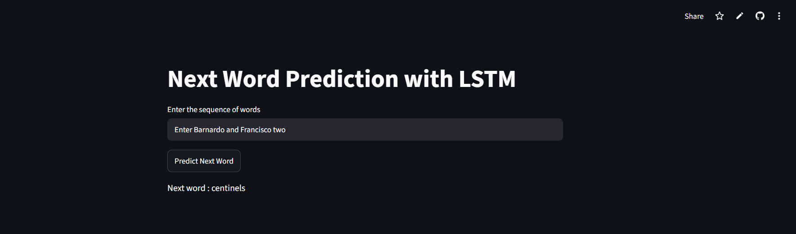

# ✍️ Next Word Prediction — LSTM RNN

**Predict the next word in a sentence, trained on Shakespeare's Hamlet — powered by a stacked LSTM network built from scratch.**

[](https://nextwordprediction-lstm-rnn-garv.streamlit.app/)
[](https://www.python.org/)
[](https://www.tensorflow.org/)
[](https://keras.io/)
[](https://streamlit.io/)
[](https://www.nltk.org/)

[**Live Demo**](https://nextwordprediction-lstm-rnn-garv.streamlit.app/) · [**Report a Bug**](https://github.com/garvkumarsharma/NextWordPrediction-LSTM-RNN/issues) · [**Request a Feature**](https://github.com/garvkumarsharma/NextWordPrediction-LSTM-RNN/issues)

---

## 📖 About The Project

**Next Word Prediction** is a deep learning project that predicts the most likely next word given a sequence of preceding words. Type in a partial sentence — or a line straight from Shakespeare — and the model predicts what word comes next, based purely on patterns it learned from the text of **Hamlet**.

Rather than fine-tuning a pre-trained language model, this project builds the sequence-modeling pipeline from first principles: turning raw Shakespearean text into overlapping n-gram training sequences, learning word embeddings from scratch, and passing them through a **stacked LSTM network** to model long-range word dependencies — then wrapping it all in a Streamlit app for interactive predictions.

This project was built as a natural extension of an earlier Simple RNN sentiment-analysis project, specifically to explore how LSTMs handle sequence/language modeling tasks that require remembering context over many prior words — something a plain `SimpleRNN` struggles with.

### 🎯 What It Does

Type any sequence of words into the app, and it will:

1. ✂️ Tokenize the input text using the same word index learned during training
2. 📏 Pad/truncate the sequence to match the model's expected input length
3. 🧠 Pass it through a trained Embedding → LSTM → LSTM → Dense pipeline
4. 🔮 Output the single most probable **next word**, chosen via `argmax` over the softmax probability distribution across the entire vocabulary

---

## 🔗 Live Demo

> ### 👉 **[nextwordprediction-lstm-rnn-garv.streamlit.app](https://nextwordprediction-lstm-rnn-garv.streamlit.app/)**

No installation needed — open the link, type in a phrase, and click Predict Next Word.

**Repository:** [github.com/garvkumarsharma/NextWordPrediction-LSTM-RNN](https://github.com/garvkumarsharma/NextWordPrediction-LSTM-RNN)

---

## 🖼️ Screenshots

| App UI | Prediction Output |
|---|---|
|  |  |

> Add your own screenshots to a `screenshots/` folder in the repo and update the paths above.

---

## ✨ Key Features

- 🔮 **Real-time next-word prediction** on any user-typed sequence, not just text seen during training
- 📚 **Trained on Shakespeare's Hamlet** via NLTK's Gutenberg corpus — a genuinely challenging, archaic vocabulary and sentence structure for a model to learn
- 🧠 **Word embeddings learned from scratch** — 100-dimensional vectors over a ~4,800-word vocabulary, capturing semantic relationships directly from the training text
- 🔁 **Stacked LSTM architecture** (150 → 100 units) to capture longer-range dependencies between words than a Simple RNN can reliably manage
- 🎯 **Dropout regularization** (0.2) between LSTM layers to reduce overfitting on a relatively small training corpus
- 🛑 **Early stopping** during training (`patience=3`, `restore_best_weights=True`) to avoid overfitting on this modest dataset
- 💾 **Persisted tokenizer** (`tokenizer.pickle`) so the exact word-index mapping from training is reused identically at inference time
- ⚡ **Lightweight Streamlit UI** — a single text input and button, focused entirely on the prediction itself

---

## 🏗️ How It Works — Architecture

```
                    ┌────────────────────┐
User Input Text ──▶ │ tokenizer.texts_to  │  → Maps words → integer indices using the SAME
                    │ _sequences()        │     tokenizer fit during training (loaded from pickle)
                    └──────────┬──────────┘
                               ▼
                    ┌────────────────────┐
                    │  pad_sequences       │  → Pads/truncates to (max_sequence_len - 1) tokens
                    └──────────┬──────────┘
                               ▼
                    ┌────────────────────┐
                    │  Embedding Layer     │  → ~4,818-word vocab → 100-dim dense vectors
                    └──────────┬──────────┘
                               ▼
                    ┌────────────────────┐
                    │  LSTM (150 units)     │  → return_sequences=True, passes full sequence forward
                    └──────────┬──────────┘
                               ▼
                    ┌────────────────────┐
                    │  Dropout (0.2)        │  → Regularization between the two LSTM layers
                    └──────────┬──────────┘
                               ▼
                    ┌────────────────────┐
                    │  LSTM (100 units)     │  → Final recurrent layer, condenses to one vector
                    └──────────┬──────────┘
                               ▼
                    ┌────────────────────┐
                    │  Dense (softmax)      │  → One neuron per vocabulary word (~4,818-way classifier)
                    └──────────┬──────────┘
                               ▼
                 argmax → Predicted Next Word (in-app)
```

**Model summary:**

| Layer         | Output Shape     | Parameters |
|---------------|------------------|------------|
| Embedding     | (None, 13, 100)  | 481,800    |
| LSTM          | (None, 13, 150)  | 150,600    |
| Dropout       | (None, 13, 150)  | 0          |
| LSTM          | (None, 100)      | 100,400    |
| Dense         | (None, 4818)     | 486,618    |

**Total parameters:** 1,219,418

---

## 📊 Dataset

- **Source:** *The Tragedie of Hamlet* by William Shakespeare, via [NLTK's Gutenberg corpus](https://www.nltk.org/book/ch02.html) (`nltk.corpus.gutenberg`)
- **Vocabulary size:** 4,818 unique words (`Tokenizer` fit on the full text, lowercased)
- **Training sequences:** ~25,700 overlapping n-gram sequences generated line-by-line from the play's text
- **Sequence length:** Padded/truncated to 13 tokens (input) predicting 1 target word

---

## 🛠️ Tech Stack

| Layer               | Technology                                                                 |
| ------------------- | --------------------------------------------------------------------------- |
| **Model**           | Stacked LSTM (`tensorflow.keras.layers.LSTM`) with an Embedding front-end   |
| **Training Data**   | Shakespeare's *Hamlet* via [NLTK Gutenberg Corpus](https://www.nltk.org/)   |
| **Framework**       | [TensorFlow](https://www.tensorflow.org/) / [Keras 3](https://keras.io/)     |
| **UI / Frontend**   | [Streamlit](https://streamlit.io/)                                          |
| **Deployment**      | Streamlit Community Cloud                                                    |
| **Language**        | Python 3.11                                                                  |

---

## 📂 Project Structure

```
NextWordPrediction-LSTM-RNN/
├── app.py                   # Streamlit UI — main entry point for deployment
├── experiments.ipynb         # Data prep, tokenization, model training, saving
├── next_word_lstm.h5          # Trained model weights (Keras H5 format) — generate via experiments.ipynb
├── tokenizer.pickle           # Saved Keras Tokenizer (word-index mapping used at training time)
├── requirements.txt            # Python dependencies
├── runtime.txt                  # Pins Python 3.11 for Streamlit Cloud deployment
├── .gitignore                    # Excludes .venv/, __pycache__/, .ipynb_checkpoints/, nltk_data/
└── README.md
```
> **Note:** `experiments.ipynb` produces both `next_word_lstm.h5` and `tokenizer.pickle`, which `app.py` loads directly at runtime. The tokenizer **must** be the exact one saved during training — refitting a new tokenizer on different text would break the word-index mapping the model was trained on. `runtime.txt` ensures Streamlit Cloud provisions Python 3.11 instead of a newer version that lacks compatible TensorFlow wheels.

---

## 🚀 Getting Started — Run It Locally

### Prerequisites

- Python 3.11 or higher

### Installation

**1. Clone the repository**
```
git clone https://github.com/garvkumarsharma/NextWordPrediction-LSTM-RNN.git
cd NextWordPrediction-LSTM-RNN
```

**2. Create and activate a virtual environment**
```
python -m venv .venv

# Windows
.venv\Scripts\activate

# macOS/Linux
source .venv/bin/activate
```

**3. Install dependencies**
```
pip install -r requirements.txt
```

**4. Train the model (if `next_word_lstm.h5` isn't already present)**

Run through `experiments.ipynb` top to bottom. It downloads the Hamlet text via NLTK, builds the training sequences, trains the LSTM model, and saves both `next_word_lstm.h5` and `tokenizer.pickle` into the project root.

**5. Run the app**
```
streamlit run app.py
```

The app will open at `http://localhost:8501`. Enter a phrase and click **Predict Next Word**.

---

## ☁️ Deployment

This project is intended for deployment on **Streamlit Community Cloud**, connected directly to this GitHub repository.

**Live app:** [nextwordprediction-lstm-rnn-garv.streamlit.app](https://nextwordprediction-lstm-rnn-garv.streamlit.app/)

To deploy your own fork:

1. Push your fork to GitHub (including `next_word_lstm.h5` and `tokenizer.pickle`)
2. Go to [share.streamlit.io](https://share.streamlit.io) → **Create app**
3. Point it at your repo, branch `main`, main file `app.py`
4. Deploy 🚀

Streamlit Cloud installs everything from `requirements.txt` automatically — no secrets or API keys are required for this project.

---

## 🧭 Roadmap / Future Improvements

- [ ] Train on a larger, more varied corpus for broader vocabulary and more natural predictions
- [ ] Return top-k next-word candidates with probabilities instead of a single argmax prediction
- [ ] Add a "keep generating" mode to produce full multi-word continuations, not just one word
- [ ] Experiment with GRU and Bidirectional LSTM variants for comparison
- [ ] Save the model in the native Keras format (`.keras`) instead of the legacy `.h5` format

---

## 👤 Author

**Garv Kumar Sharma**

- GitHub: [@garvkumarsharma](https://github.com/garvkumarsharma)
- LinkedIn: [linkedin.com/in/garv-kumar-sharma](https://www.linkedin.com/in/garv-kumar-sharma)

---

## 📄 License

This project is open source and available under the [MIT License](LICENSE).

---

If you found this project interesting, consider giving it a ⭐ on GitHub!